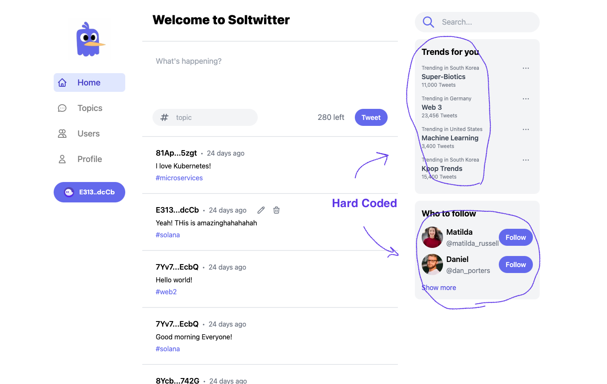

# Soltwitter - A Decentralized Twitter
Soltwitter is a decentralized version of [Twitter](https://twitter.com), running on Solana blockchain.
While the code in this repo mostly follows this [tutorial](https://lorisleiva.com/create-a-solana-dapp-from-scratch) by @lorisleiva, I've implemented the frontend part with Next.js which was originally done with Vue.js.

## Work in progress 
Still I need to style more, and add more features.

## Tech stacks
- Program(also known as Smart Contract in other blockchains)
	- Solana, as a choice of blockchain
	- Anchor, for building Solana programs in super-easy manner
	- Rust as a blockchain-side language
- Testing
	- Mocha, specifically ts-mocha
	- Typscript for better typing
- Frontend
	- Next.js
	- Solana web3 library
	- TailwindCSS

